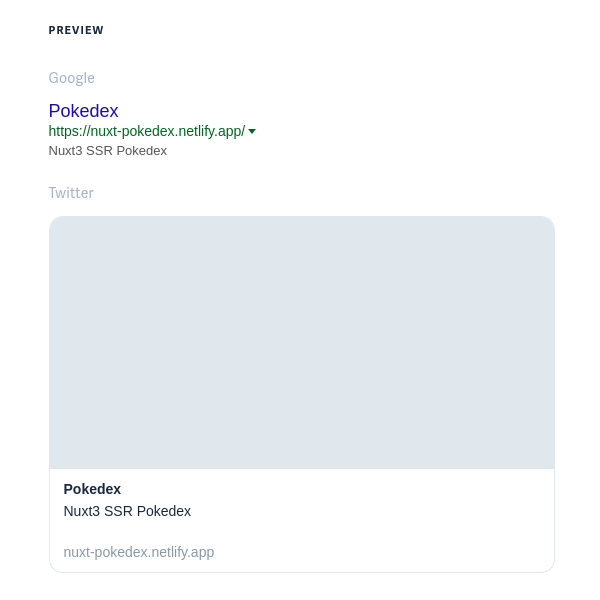
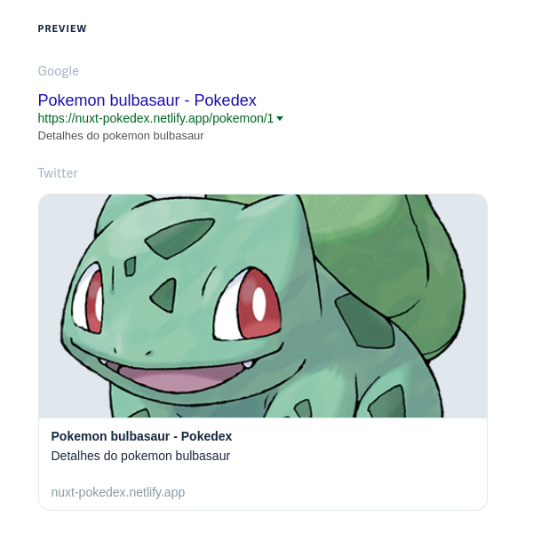
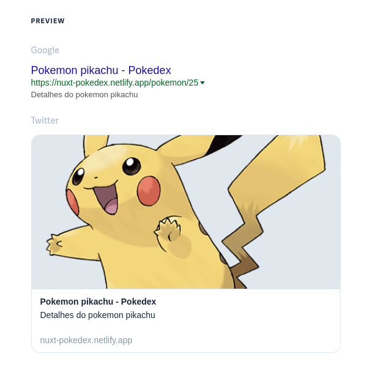

# Nuxt

> Projeto simples para demonstrar o ssr com o nuxt, todas as paginas são geradas estaticamente do lado do servidor em tempo de execução.

## Scripts

```bash
$ npm install # Instalar dependências
$ npm run dev # Rodar o servidor
$ npm run build # Construir projeto no modo ssr
$ npm run generate # Construir projeto no modo estático
$ npm run preview # Visualizar build do projeto
```

### Meta tags geradas sob demanda





Exemplo hospedado na [netlify](https://nuxt-pokedex.netlify.app/) no modo ssr usando as netlify functions.
